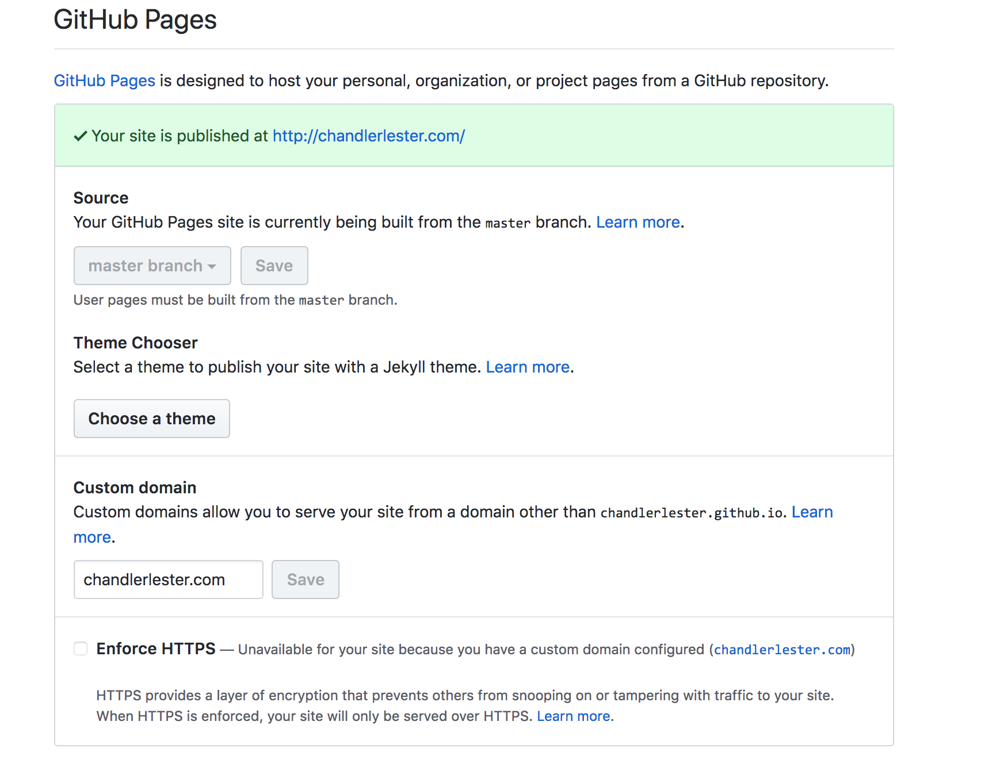
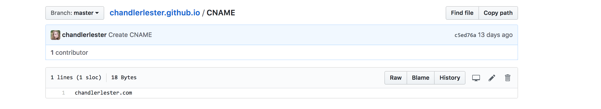
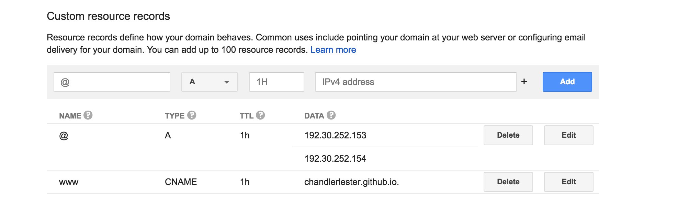

## Getting Started 

I already owned my domain name: <http://chandlerlester.com> via google domains. 

*  Create a special github repository.  
    + It needs the following naming format: username.github.io  
    + Note: this process will be a little simpler if your username is the same as your desired domain name. 

## Settings (on Github)

There are several important settings you need to change to host your domain through github. 

     1. Change the following under settings in Github (above the Danger Zone)  

## More Settings

    2. Create a CNAME file 

    3. Change DNS settings 

 

## Customization 

There are a lot of Jeykll themes for github pages. Many people create these themes for free.  

*  [Michael Rose](http://github.com/mmistakes)  
    + [Minimal Mistakes](http://github.com/mmistakes/minimal-mistakes)  
    + [So Simple](http://github.com/mmistakes/so-simple-theme)  
    + [Basically Basic](https://mmistakes.github.io/jekyll-theme-basically-basic/)
        
* [Diana Mounter](https://github.com/broccolini)  
    +  [Swiss](https://github.com/broccolini/swiss)  
    +  [Athena](https://github.com/broccolini/athena)  
        
* [David Darnes](https://github.com/daviddarnes)  
    + [Alembic](https://github.com/daviddarnes/alembic)
        
Find more [here](https://github.com/planetjekyll/awesome-jekyll-themes)

## How Did I Personalize My Site? 

    1. I forked the Minimal Mistakes repo 
    
    2. Then I followed the online tutorial for some basic edits  
    
    3. Since I am obsessed with customization, I made a lot of other changes 
  + [Look at how many commits I have!](https://github.com/chandlerlester/chandlerlester.github.io)
    
## How Customizable are these Sites? 

Grant's website is also built on Minimal Mistakes, see how different [his](http://grantmcdermott.com) site from [mine](http://chandlerlester.com)! 

These designer's constantly update themes, and they all have a lot of customizable settings. 

## Let's Play Around with Some of the Basic Settings 

## References 

* Github Guides: [setting up the website repo](https://guides.github.com/features/pages/)  
* Luis L, Medium.com: [Github pages & google domains](https://guides.github.com/features/pages/)
* [Michael Rose](http://github.com/mmistakes): [minimal mistakes set up](https://mmistakes.github.io/minimal-mistakes/)
* [Adam Pritchard](https://github.com/adam-p): [Markdown Cheatsheet](https://github.com/adam-p/markdown-here/wiki/Markdown-Cheatsheet)

       
